# Super Duper Cake Shop
A responsive website for a fake cake shop. The responsive design is implemented using CSS Flexbox (and a smaller cake icon for smaller screens).

## Screenshots
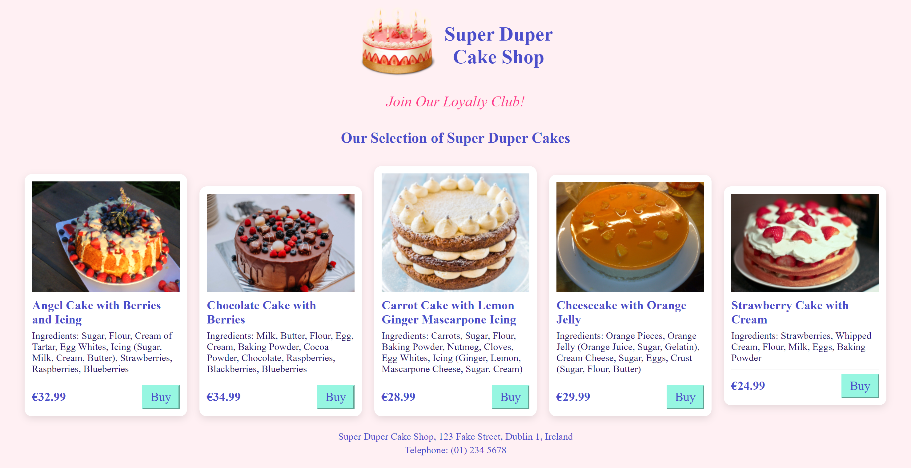
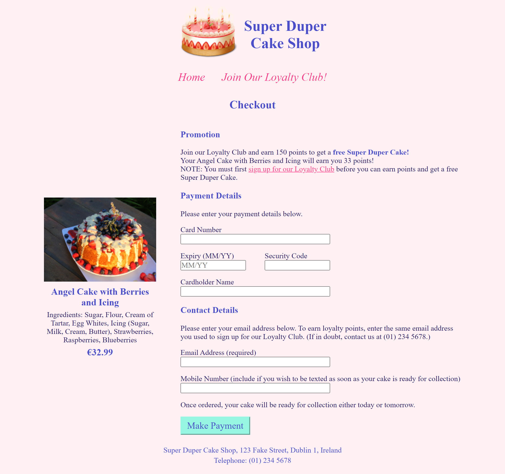
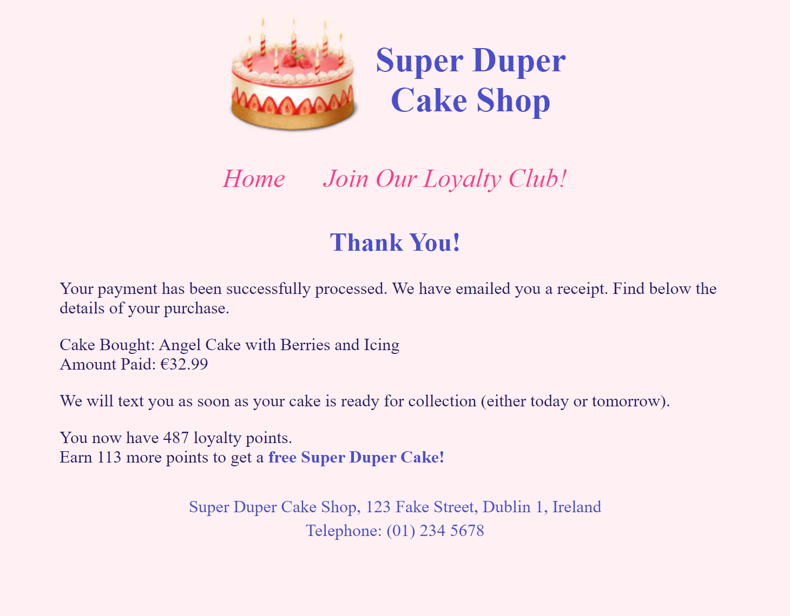
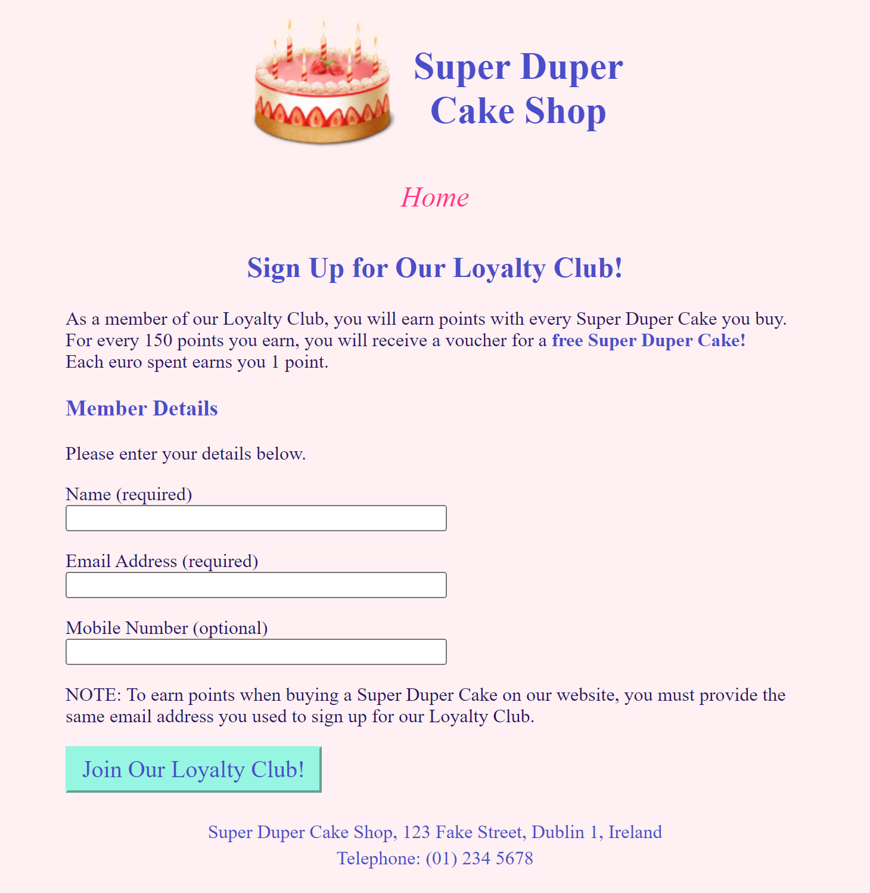
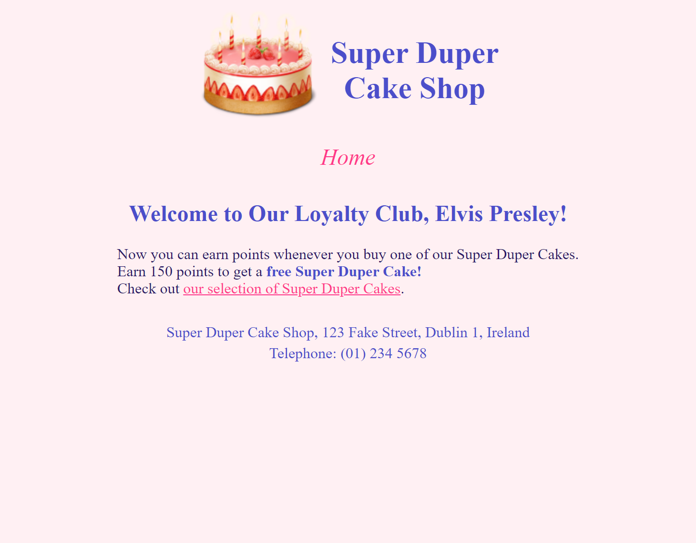
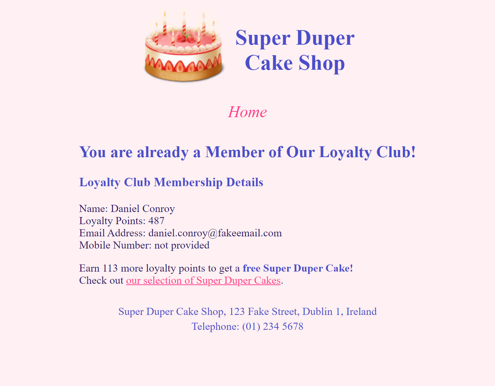

## Responsive Design
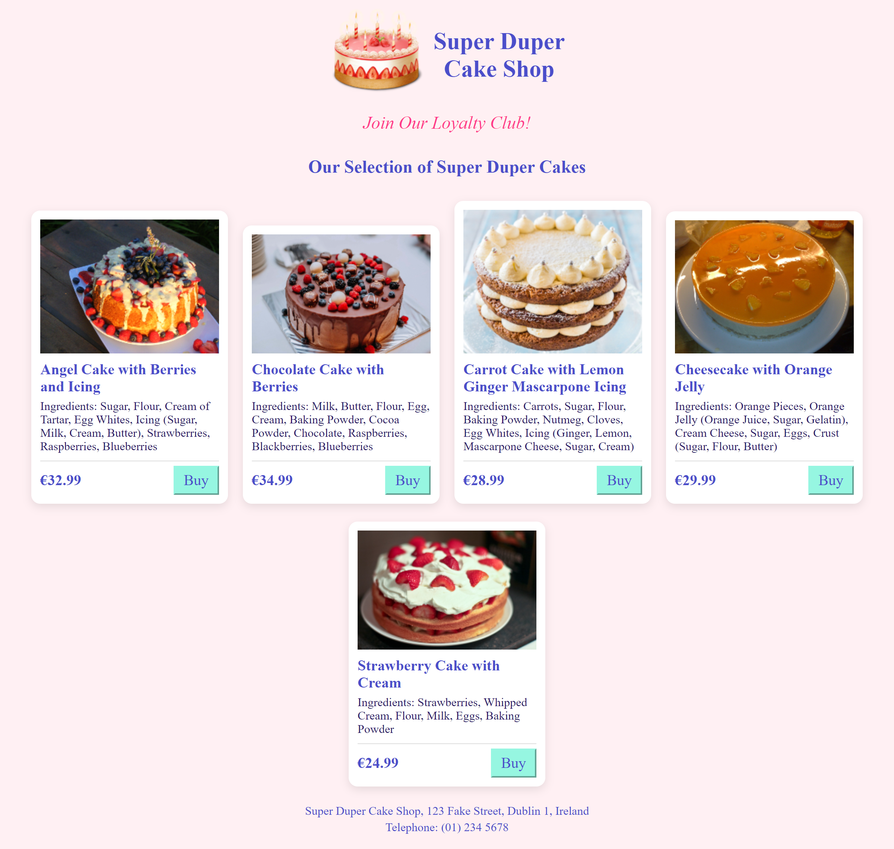
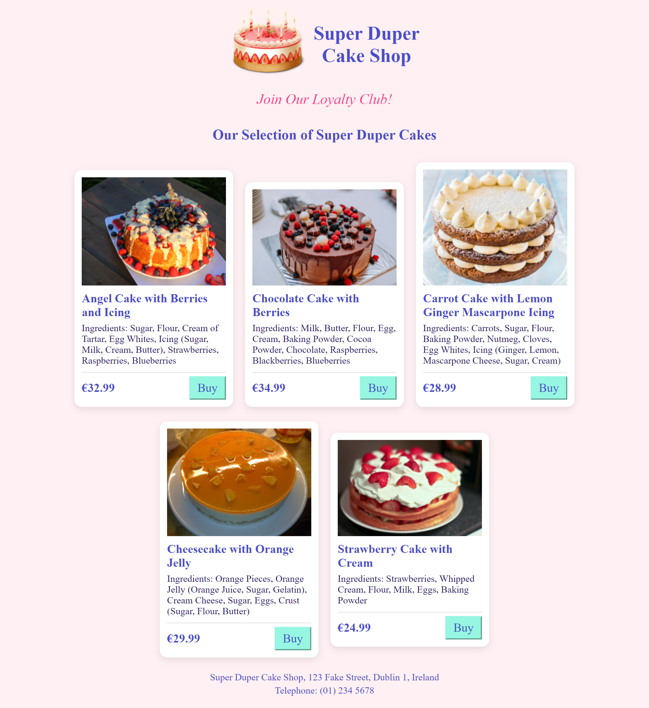
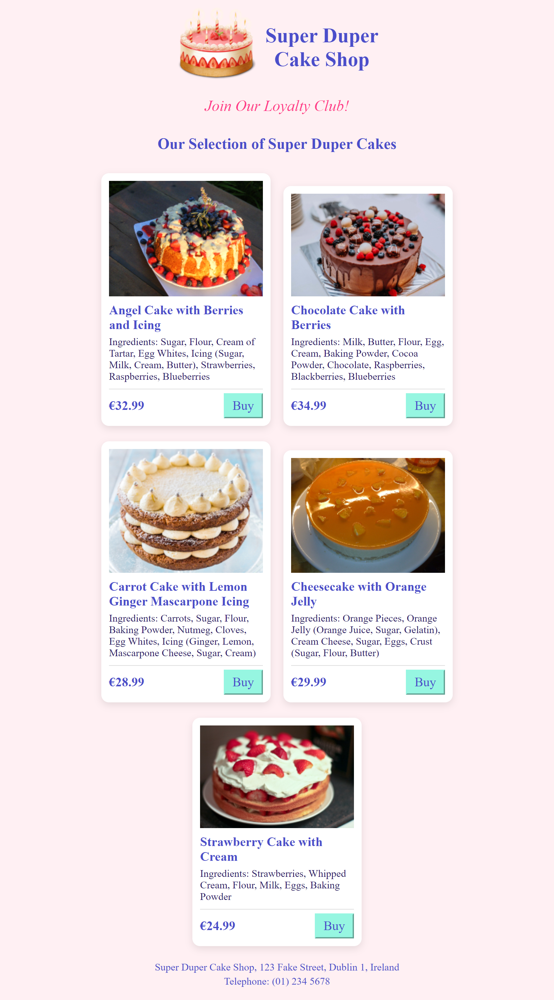
<table><tr><td>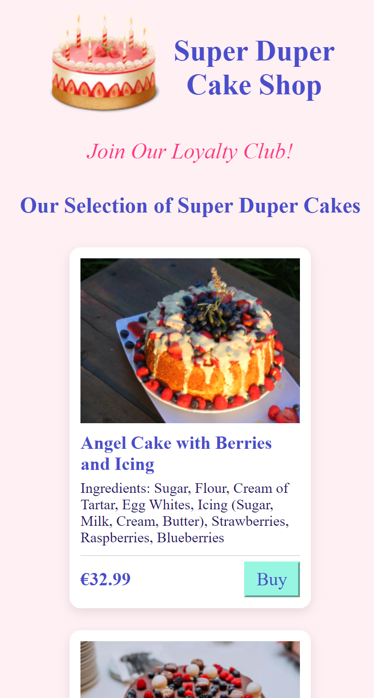</td><td>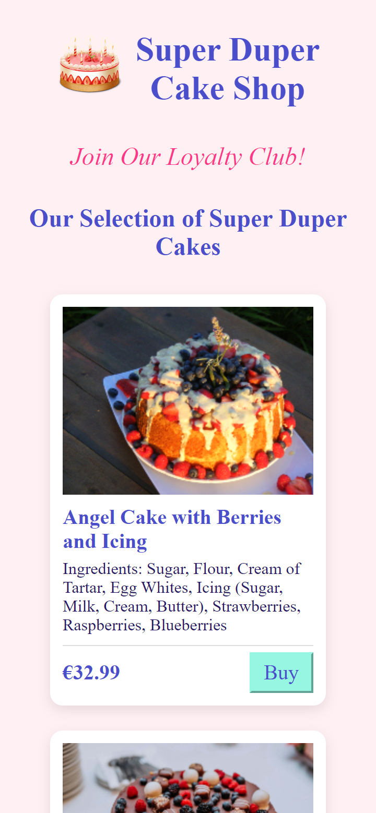</td><td>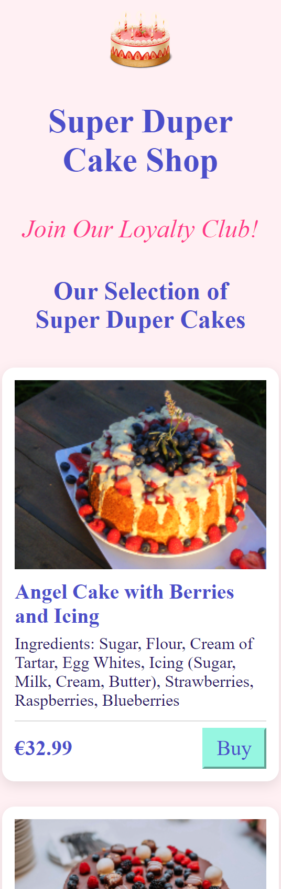</td></tr></table>
<table><tr><td>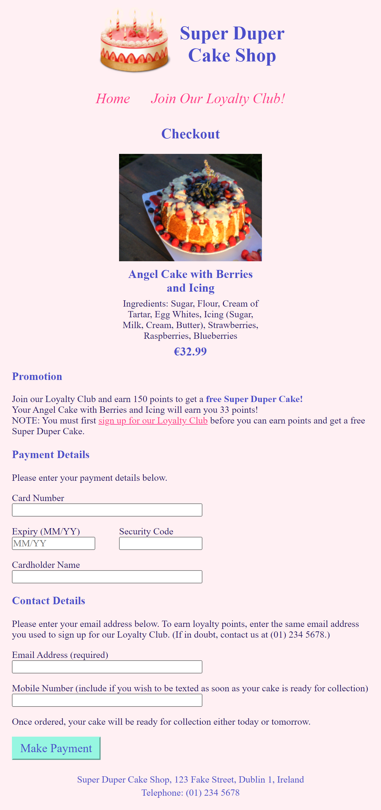</td><td>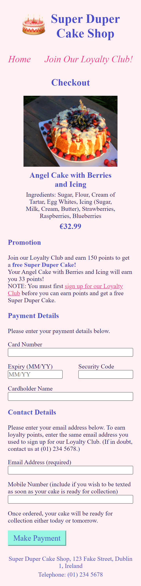</td><td>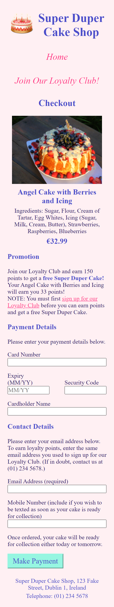</td></tr></table>
